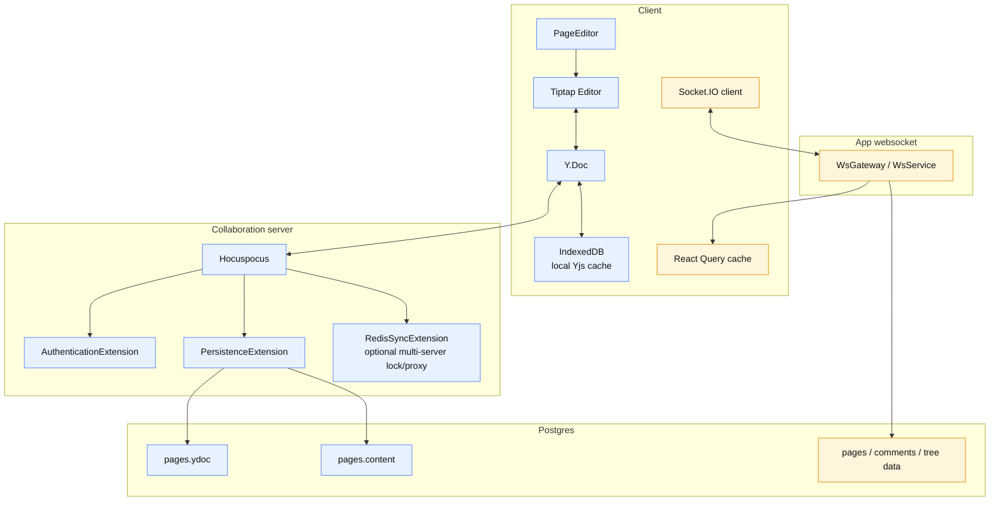
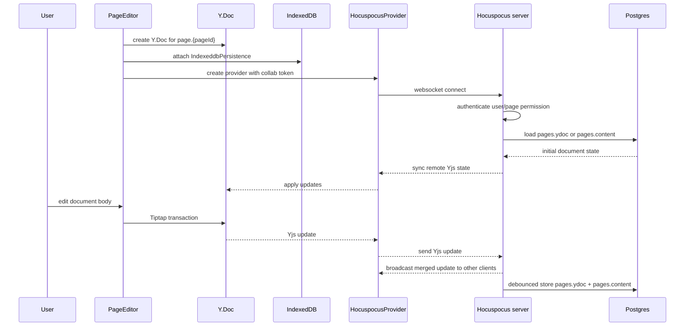
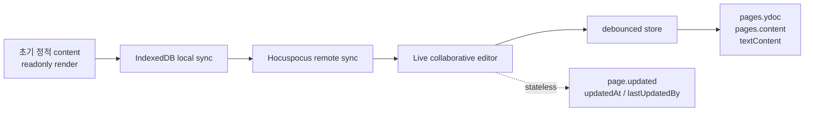
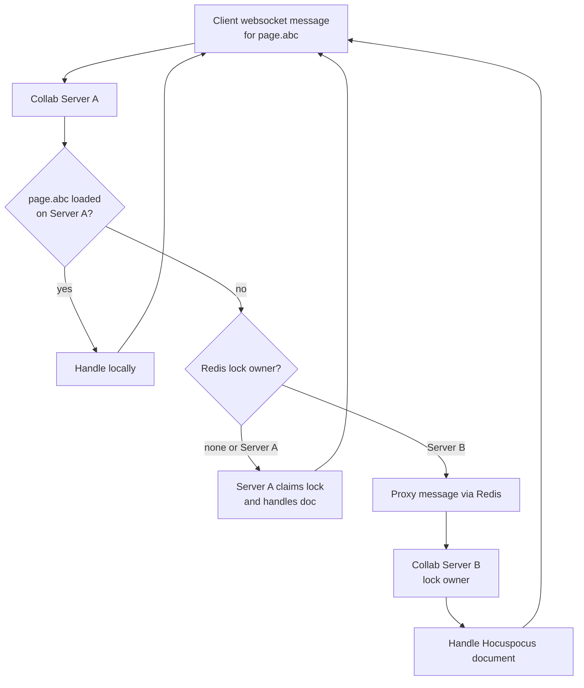
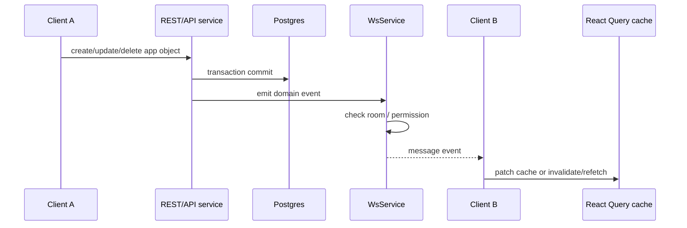

# Docmost와 Notion의 동시성/실시간 협업 모델 조사

조사일: 2026-06-11

이 문서는 Docmost 위에 Notion식 Database 기능을 추가할 때, 기존 문서 협업 모델과 database grid 동시 편집 모델을 어떻게 이해해야 하는지 정리한 것이다.

## 결론

Docmost에는 이미 두 종류의 실시간 동기화 계층이 있다.

```text
1. 문서 본문 협업
   Hocuspocus + Yjs + Tiptap Collaboration
   같은 page body를 여러 사용자가 동시에 편집

2. 앱 상태 이벤트 동기화
   Socket.IO + React Query cache 갱신
   page tree, comments, notification 같은 구조화 이벤트 반영
```

Notion도 제품 동작상 두 종류의 협업이 보인다.

```text
1. Page/block 동시 편집
   같은 page 또는 같은 block을 여러 사용자가 동시에 편집 가능
   lock 없이 최신 변경이 반영됨

2. Database item/property 동시 편집
   database도 여러 사용자가 동시에 보고 편집 가능
   database row는 page이고, property value는 page metadata로 업데이트됨
```

다만 Notion 내부 구현은 공개되어 있지 않다. Notion이 CRDT, OT, event log, custom sync layer 중 무엇을 쓰는지는 공식 문서만으로 확정할 수 없다. 이 문서에서는 공식 문서/API로 확인되는 개념과 Docmost 코드에서 확인되는 구현만 구분한다.

Docmost에 Database 기능을 추가할 때의 방향은 다음이 적절하다.

```text
Record page body
  기존 Hocuspocus/Yjs 문서 협업 재사용

Database grid/property value
  Yjs 문서로 넣지 말고 서버 API + domain event + cache update로 처리

Schema/view 변경
  서버 transaction으로 저장하고, 변경 이벤트 수신 시 view 전체 refetch
```

전체 그림은 다음처럼 보면 된다.



파란 흐름은 **문서 본문 협업**이다. 사용자가 문장, 블록, 표 안의 텍스트를 편집할 때 이 경로를 탄다.

노란 흐름은 **앱 상태 이벤트 동기화**다. 댓글 생성, page tree 변경, cache invalidation 같은 구조화 이벤트가 이 경로를 탄다.

## Docmost의 현재 동시성 모델

### 1. 문서 본문 협업: Hocuspocus + Yjs

Docmost의 page editor는 Yjs document를 만들고 Hocuspocus provider에 연결한다.

관련 파일:

- `apps/client/src/features/editor/page-editor.tsx`
- `apps/client/src/features/editor/extensions/extensions.ts`
- `apps/server/src/collaboration/collaboration.gateway.ts`
- `apps/server/src/collaboration/extensions/persistence.extension.ts`
- `apps/server/src/collaboration/extensions/authentication.extension.ts`

클라이언트 흐름은 다음과 같다.



서버 흐름은 다음과 같다.

```text
CollaborationGateway
  Hocuspocus 서버 생성
  AuthenticationExtension
  PersistenceExtension
  LoggerExtension
  RedisSyncExtension 선택적 사용

PersistenceExtension.onLoadDocument
  page.ydoc이 있으면 DB의 Yjs state를 로드
  없으면 page.content JSON을 Ydoc으로 변환
  content도 없으면 새 Y.Doc 생성

PersistenceExtension.onStoreDocument
  Ydoc을 Tiptap JSON으로 변환
  Ydoc update state를 Buffer로 저장
  page.content, textContent, ydoc, lastUpdatedById 갱신
  page.updated stateless message broadcast
  mentions, AI indexing, history job enqueue
```

중요한 점은 Docmost의 문서 본문은 **최종 저장 포맷을 두 개로 유지**한다는 것이다.

```text
page.ydoc
  협업 편집의 source of truth에 가까운 Yjs state

page.content
  서버 조회/렌더링/검색/기타 기능에서 쓰는 Tiptap JSON snapshot
```

문서 편집 중에는 Yjs update가 실시간으로 병합되고, 저장 시점에는 Hocuspocus debounce 설정에 따라 DB에 반영된다.

현재 설정:

```text
debounce: 10000
maxDebounce: 45000
unloadImmediately: false
```

즉 매 keystroke마다 DB에 쓰는 것이 아니라, 변경을 모아서 저장한다.

문서 본문 협업만 놓고 보면 한 page는 다음 상태들을 가진다.



`PageEditor`는 처음부터 live editor를 바로 보여주지 않는다. 로컬/원격 sync가 끝나기 전에는 받은 `content`를 readonly로 보여주고, 연결이 잡히면 live collaborative editor로 전환한다.

### 2. 문서 협업 권한 처리

`AuthenticationExtension`은 collab websocket 연결 시 다음을 확인한다.

```text
1. collab JWT 검증
2. user 조회
3. page 조회
4. space member role 확인
5. page-level restriction 확인
6. 편집 권한이 없으면 connectionConfig.readOnly = true
7. 삭제된 page도 readOnly 처리
```

따라서 Docmost의 문서 협업은 connection 단계에서 read/write 권한을 나눈다.

Database record page body를 기존 Page로 만들면, record body 편집 권한도 이 경로를 재사용할 수 있다.

### 3. 여러 서버에서의 문서 소유권: RedisSyncExtension

Docmost는 collab 서버가 여러 개일 때를 고려한다. `RedisSyncExtension`은 documentName별 lock을 Redis에 잡고, 특정 문서를 한 서버 인스턴스가 소유하도록 만든다.

개념 흐름:



이 구조는 같은 Yjs document가 여러 서버에서 동시에 따로 로드되어 diverge되는 문제를 줄이기 위한 것이다.

### 4. 서버에서 Yjs 문서를 직접 수정하는 경로

`CollaborationHandler`는 서버 코드가 직접 Yjs document를 열어 transaction을 실행할 수 있게 한다.

예:

```text
setCommentMark
  comment mark를 Yjs fragment에 적용

resolveCommentMark
  comment mark의 resolved 속성 갱신

updatePageContent
  page content replace/prepend/append
```

이때도 Hocuspocus direct connection을 열고 transaction 안에서 Yjs fragment를 수정한다.

이 패턴은 중요하다. Database record body에 자동 템플릿을 적용하거나, import/export가 본문을 수정해야 할 때 기존 협업 경로와 충돌하지 않게 처리할 수 있다.

### 5. 앱 상태 이벤트 동기화: Socket.IO + React Query

Docmost에는 문서 본문 협업과 별도로 Socket.IO 기반 이벤트 동기화가 있다.

관련 파일:

- `apps/server/src/ws/ws.gateway.ts`
- `apps/server/src/ws/ws.service.ts`
- `apps/client/src/features/websocket/use-query-subscription.ts`
- `apps/client/src/features/websocket/use-query-emit.ts`
- `apps/client/src/features/websocket/use-tree-socket.ts`

이 계층은 Yjs 문서 편집용이 아니라, 구조화된 앱 이벤트를 클라이언트 cache에 반영하기 위한 것이다.

예:

```text
commentCreated
commentUpdated
commentDeleted
addTreeNode
moveTreeNode
deleteTreeNode
updateOne
invalidate
verificationUpdated
```

클라이언트는 `message` 이벤트를 받고 React Query cache를 직접 수정하거나 invalidate/refetch한다.

이 모델은 Notion식 database grid에 더 가깝다. Cell value, record create/delete, view update 같은 변경은 Yjs 문서 조각보다 domain event로 표현하는 것이 자연스럽다.

흐름은 다음과 같다.



이 경로는 “문서 내용을 병합”하지 않는다. 서버에서 이미 확정된 결과를 다른 클라이언트에게 알려주고, 클라이언트는 cache를 맞춘다.

## Notion의 공개 동시성 모델

### 확인된 제품 동작

Notion 공식 Help 문서 기준으로 확인되는 동작은 다음과 같다.

- 여러 사람이 같은 page 또는 database를 동시에 보고 편집할 수 있다.
- 같은 block도 동시에 편집 가능하며, 다른 사람이 편집 중이라고 content가 lock되지 않는다.
- 최신 변경이 page에 반영된다.
- 같은 page를 보는 사람들의 avatar/presence를 볼 수 있다.
- edits와 comments가 실시간으로 나타난다.
- page/database를 lock해서 실수로 구조나 내용을 바꾸는 것을 막을 수 있다.

공식 문서 표현상 Notion은 “동시 편집 가능”과 “lock 없는 block 편집”을 제품 기능으로 제공한다. 하지만 내부 알고리즘은 공개하지 않는다.

### 확인된 API 모델

Notion API 기준으로 database 관련 모델은 다음과 같다.

```text
Database
  하나 이상의 data source를 담는 컨테이너

Data source
  properties schema를 가진 데이터 묶음
  rows는 page

Page
  parent가 data source이면 database row/item
  properties는 data source schema를 따름
  content는 blocks로 조회/수정

Page properties
  database row에 붙은 구조화 metadata
```

API에서 property value 수정은 `Update page`로 처리한다. 즉 database cell/property value는 page metadata 업데이트로 노출된다.

```text
PATCH page
  properties body로 data source에 속한 page property values 수정
```

Data source query는 filter/sort 조건에 맞는 page 목록을 pagination으로 반환한다.

```text
Query data source
  filter: property 조건
  sorts: property 또는 timestamp 기준
  result: pages[]
```

이 API 모델은 database grid를 “문서 본문 CRDT”처럼 다루기보다, structured page properties를 query/update하는 모델에 가깝게 보여준다.

### 공개되지 않은 부분

다음은 공식 문서만으로 확정할 수 없다.

- Notion page body가 CRDT인지 OT인지
- database property value 변경이 내부적으로 event sourcing인지 direct DB update인지
- 같은 cell을 동시에 수정할 때 정확한 conflict resolution 규칙
- offline 상태에서 database property 변경을 어떻게 merge하는지
- view/filter/sort/schema 변경이 어떤 동기화 프로토콜을 쓰는지

따라서 Docmost 설계에서 “Notion이 이렇게 구현했으니 그대로 따라가자”라고 말할 수는 없다. 대신 Notion의 공개 모델과 제품 동작에 맞는 수준으로 설계해야 한다.

## Docmost Database 기능에 대한 동시성 설계 제안

### 1. Record page body는 기존 Yjs 협업을 재사용한다

Database record를 Docmost page로 만든다면, record를 열었을 때의 본문은 기존 PageEditor와 CollaborationGateway를 그대로 쓸 수 있다.

```text
database record page open
  documentName = page.{recordPageId}
  기존 Hocuspocus/Yjs 협업 사용
  기존 page permission/readOnly 처리 사용
  기존 history/mentions/indexing 흐름 사용
```

이 부분을 새로 만들 필요는 없다.

### 2. Database grid는 Yjs document에 넣지 않는다

Database grid의 변경은 텍스트 병합 문제가 아니라 구조화 데이터 변경이다.

예:

```text
Status = Done
Due date = 2026-06-20
Assignee = user_123
record created
record deleted
property schema changed
view sort changed
```

이 값들을 하나의 거대한 Yjs document로 넣으면 다음 문제가 생긴다.

- filter/sort/query가 DB와 분리되어 복잡해진다.
- 서버 권한 검사와 transaction 처리 위치가 흐려진다.
- schema 변경과 cell 변경 충돌 처리가 어려워진다.
- 대량 record에서 Yjs document가 무거워질 수 있다.
- Notion API 모델과도 맞지 않는다. Notion은 property value를 page metadata update로 노출한다.

따라서 grid는 다음 모델이 적합하다.

```text
client mutation
  optimistic update
  REST/RPC API 호출
  server transaction
  DB 저장
  domain event broadcast
  다른 client가 cache update 또는 refetch
```

### 3. Database grid 이벤트는 Socket.IO 계층을 확장한다

Docmost에는 이미 `WsService`와 `useQuerySubscription`이 있다. Database용 이벤트를 여기에 추가하는 방식이 자연스럽다.

예상 이벤트:

```text
database.record.created
database.record.deleted
database.record.restored
database.record.moved
database.property_value.updated
database.property.created
database.property.updated
database.property.deleted
database.view.created
database.view.updated
database.view.deleted
database.schema.changed
```

Cell value update 예:

```json
{
  "operation": "database.property_value.updated",
  "databaseId": "db_1",
  "recordId": "rec_1",
  "propertyId": "prop_status",
  "value": { "optionId": "done" },
  "updatedAt": "2026-06-11T10:00:00.000Z",
  "updatedById": "user_1"
}
```

클라이언트 처리:

```text
property_value.updated
  현재 view query cache에 record가 있으면 cell만 patch
  filter 결과에서 빠질 수 있으면 해당 view query invalidate

schema.changed
  database schema query invalidate
  open view data refetch

view.updated
  view config query invalidate
  해당 view refetch
```

### 4. 충돌 정책은 변경 유형별로 나눈다

Database grid는 문서 본문처럼 문자 단위 merge가 필요한 영역이 아니다. 변경 유형별 정책이 필요하다.

```text
같은 cell 동시 수정
  last write wins
  updatedAt/updatedBy 표시

서로 다른 cell 동시 수정
  둘 다 성공

record 삭제와 cell 수정이 동시에 발생
  삭제가 먼저 commit되었으면 cell 수정은 404/409
  cell 수정이 먼저 commit되었으면 이후 삭제됨

property 삭제와 cell 수정이 동시에 발생
  property 삭제가 먼저 commit되었으면 cell 수정은 404/409
  cell 수정이 먼저 commit되었으면 이후 property 삭제로 값도 제거됨

property type 변경
  서버 transaction에서 기존 value 변환 또는 무효화 정책 필요
  클라이언트는 schema.changed 수신 후 전체 refetch

view filter/sort 변경
  공유 view 변경이면 view.updated broadcast
  개인 임시 정렬/필터라면 서버 저장하지 않음
```

### 5. 공유 상태와 개인 UI 상태를 분리한다

Database view에서 모든 UI 상태를 공유 이벤트로 만들면 불필요하게 복잡해진다.

공유해야 할 상태:

```text
view 이름
layout
filter
sort
group
visible properties
property order
default view config
```

개인 상태로 둘 것:

```text
scroll position
selected cell
open menu
temporary hover/focus
column width
local unsaved filter draft
```

Notion에도 view lock, database lock, can edit content 같은 개념이 있으므로, 공유 view/schema 변경과 content value 변경 권한은 분리하는 것이 맞다.

### 6. 권한과 이벤트 broadcast

Database grid event는 권한을 고려해서 보내야 한다.

MVP에서는 다음처럼 단순화한다.

```text
database page를 볼 수 있는 사용자만 database room join
database page를 수정할 수 있는 사용자만 cell/value mutation 가능
structure edit 권한이 있는 사용자만 schema/view mutation 가능
```

Docmost의 `WsService`는 restricted page가 있는 space에서 authorized user만 이벤트를 받도록 필터링하는 로직이 이미 있다. Database event도 이 원칙을 따라야 한다.

초기 구현에서는 database 단위 room을 둘 수 있다.

```text
space:{spaceId}
database:{databaseId}
```

Record별 권한이나 person-property 기반 access를 나중에 추가하면, broadcast 대상 필터링도 더 세밀해져야 한다.

## 비교 요약

| 영역 | Docmost 현재 | Notion 공개 동작/API | Docmost Database 제안 |
| --- | --- | --- | --- |
| 문서 본문 | Hocuspocus + Yjs + Tiptap | 같은 page/block 동시 편집 가능 | 기존 방식 재사용 |
| cursor/presence | CollaborationCaret | avatar/presence 표시 | 본문은 기존 방식 재사용 |
| 본문 저장 | Ydoc + Tiptap JSON snapshot | Blocks/page content로 노출 | record page body에 재사용 |
| property/cell | 현재 Notion식 database 없음 | page properties update | 서버 API + DB transaction |
| grid 실시간 반영 | Socket.IO 이벤트 + React Query cache 패턴 존재 | database 동시 편집 가능, 내부 구현 비공개 | domain event broadcast |
| 충돌 처리 | 본문은 Yjs merge | 최신 변경 반영이라고 설명, 세부 규칙 비공개 | cell은 last write wins, schema는 refetch |
| 다중 서버 | RedisSync document lock/proxy | 비공개 | grid는 DB transaction 중심, 본문은 기존 RedisSync |

## 구현 방향 정리

Docmost에 Notion식 Database를 추가할 때 동시성 관점의 최종 방향은 다음과 같다.

```text
1. Database record body는 기존 PageEditor/Hocuspocus/Yjs를 그대로 사용한다.
2. Database property value는 Yjs가 아니라 서버 API로 수정한다.
3. Cell mutation은 optimistic update 후 서버 transaction으로 확정한다.
4. 확정된 변경은 Socket.IO domain event로 broadcast한다.
5. 클라이언트는 event를 받아 React Query cache patch 또는 invalidate/refetch한다.
6. Schema/view 변경은 cell patch보다 보수적으로 처리하고 전체 refetch를 기본값으로 둔다.
7. 같은 cell 동시 수정은 last write wins로 시작한다.
8. 삭제/스키마 변경과 충돌하는 mutation은 서버가 404/409로 거절한다.
9. 공유 view config와 개인 UI state를 분리한다.
10. 이벤트 broadcast는 database/page 권한을 기준으로 제한한다.
```

이 방식은 Docmost의 현재 구조를 가장 적게 흔든다. 문서 본문 협업이라는 기존 강점은 그대로 쓰고, Notion식 database grid는 구조화 데이터에 맞는 API/event 모델로 추가하는 방향이다.

## 참고 문서

Notion 공식 문서:

- Collaborate in a workspace
  - https://www.notion.com/help/collaborate-within-a-workspace
- Collaborate with people
  - https://www.notion.com/help/collaborate-with-people
- Intro to databases
  - https://www.notion.com/help/intro-to-databases
- Sharing & permissions settings
  - https://www.notion.com/help/sharing-and-permissions
- Notion API: Database object
  - https://developers.notion.com/reference/database
- Notion API: Data source object
  - https://developers.notion.com/reference/data-source
- Notion API: Page object
  - https://developers.notion.com/reference/page
- Notion API: Update page
  - https://developers.notion.com/reference/patch-page
- Notion API: Page property values
  - https://developers.notion.com/reference/page-property-values
- Notion API: Query data source
  - https://developers.notion.com/reference/query-a-data-source

Docmost 코드 기준:

- `apps/client/src/features/editor/page-editor.tsx`
- `apps/client/src/features/editor/extensions/extensions.ts`
- `apps/server/src/collaboration/collaboration.gateway.ts`
- `apps/server/src/collaboration/extensions/authentication.extension.ts`
- `apps/server/src/collaboration/extensions/persistence.extension.ts`
- `apps/server/src/collaboration/extensions/redis-sync/redis-sync.extension.ts`
- `apps/server/src/collaboration/collaboration.handler.ts`
- `apps/server/src/ws/ws.service.ts`
- `apps/client/src/features/websocket/use-query-subscription.ts`
